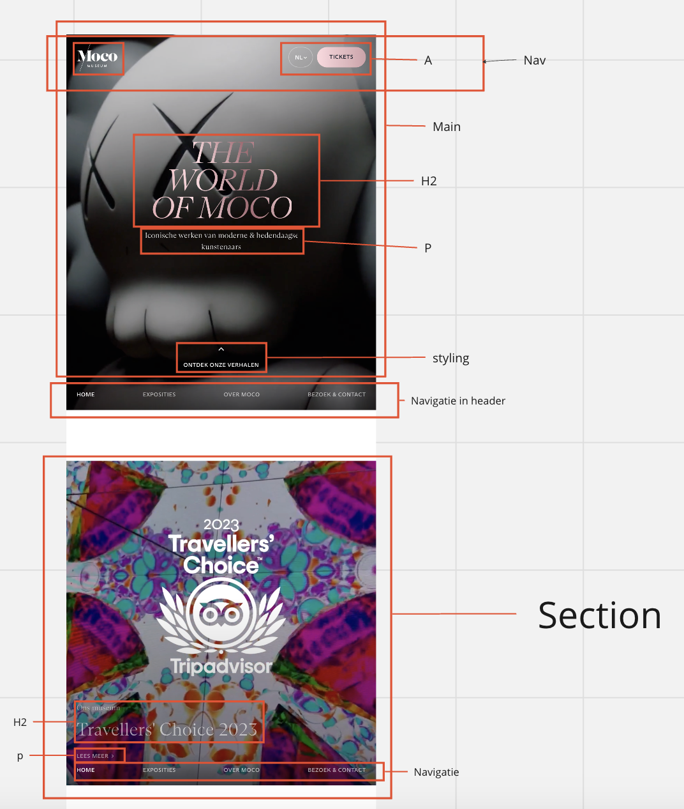

# Procesverslag
Markdown is een simpele manier om HTML te schrijven.  
Markdown cheat cheet: [Hulp bij het schrijven van Markdown](https://github.com/adam-p/markdown-here/wiki/Markdown-Cheatsheet).

Nb. De standaardstructuur en de spartaanse opmaak van de README.md zijn helemaal prima. Het gaat om de inhoud van je procesverslag. Besteedt de tijd voor pracht en praal aan je website.

Nb. Door *open* toe te voegen aan een *details* element kun je deze standaard open zetten. Fijn om dat steeds voor de relevante stuk(ken) te doen.

## Jij

  
uitwerken voor kick-off werkgroep

  ### Auteur:
  Karlijn Rotteveel

  #### Je startniveau:
  Blauw

  #### Je focus:
  Surface plane
 

## Je website

  
uitwerken voor kick-off werkgroep

  ### Je opdracht:
  https://mocomuseum.com

  #### Screenshot(s) van de eerste pagina (small screen): 
  hier de naam van de pagina  
  

  #### Screenshot(s) van de tweede pagina (small screen):
  hier de naam van de pagina  
  
 

## Toegankelijkheidstest 1/2 (week 1)

  
uitwerken na test in 2e werkgroep

  ### Bevindingen
  Lijst met je bevindingen die in de test naar voren kwamen:
  - Zijn meerdere H1's in bestaande website
  - De H1 is ook niet meer te lezen met de screenreader als je hem klein maakt.
  - Geen nette html
  - Nav staat onderaan en die pakt de screenreader ook niet meteen

## Breakdownschets (week 1)

  
uitwerken na afloop 3e werkgroep

  ### de hele pagina: 
  

  ### dynamisch deel (bijv menu): 
 n.v.t.
  

## Voortgang 1 (week 2)

  
uitwerken voor 1e voortgang

  ### Stand van zaken
  Ik vond het nestelen van de elementen lastig van de HTML. Maar na een ruwe opzet heb ik daar al hulp bij gekregen en kan ik nu goed verder. De opdrachten in de les gaan eigenlijk best wel goed. Het toepassen op de site wordt uitdagend maar leuk. Daar is natuurlijk geen stappenplan voor, helaas.

  ### Agenda voor meeting
  samen met je groepje opstellen
  Karlijn:
  Wanneer afbeelding in html en wanneer is CSS

  Joost:
  mag een <h2> in een <a>?
  wanneer svg en wanneer een button?
  mag een <ul> in een <ul>?
  wat zijn handige volgordes van   
 <h2> enz.?

  Tygo:
  werkt een aside laten uit en inschuiven hetzelfde als de menu opdracht?
  hoe maak ik een dropdown menu die alle onderstaande content verder omlaag duwt?
  hoe zorg ik ervoor dat ( checkbox ) filters zich daadwerkelijk toepassen op de artikelen die de website mij zal tonen?
  hoe zorg ik dat het stuk tekst dat zegt hoeveel resultaten er gevonden zijn zich aanpast afhankelijk van het aantal resultaten?

  Annika:
  Hamburger menu en werking

  ### Verslag van meeting
  hier na afloop snel de uitkomsten van de meeting vastleggen
  - Als img een betekenis heeft of inhoudelijk waarde, dan in html. Saaie achtergrond afbeelding -> css.
  - Z-index gebruiken voor lagen
  - Kevin Powell flex box vs grid kijken
  -

## Voortgang 2 (week 3)

  
uitwerken voor 2e voortgang

  ### Stand van zaken
  hier dit ging goed & dit was lastig (neem ook screenshots op van delen van je website en code)

  ### Agenda voor meeting
  - rand rechts
  - afbeelding door
  - positionering tekst

  ### Verslag van meeting
  hier na afloop snel de uitkomsten van de meeting vastleggen

  - punt 1
  - punt 2
  - nog een punt
- ...

## Toegankelijkheidstest 2/2 (week 4)

  
uitwerken na test in 9e werkgroep

  ### Bevindingen
  Lijst met je bevindingen die in de test naar voren kwamen (geef ook aan wat er verbeterd is):

## Voortgang 3 (week 4)

  
uitwerken voor 3e voortgang

  ### Stand van zaken

  ### Agenda voor meeting
  samen met je groepje opstellen
  - Gradient op section krijgen. (karlijn)
  - Hoe maak ik mijn nav zo dat hij alleen te zien is als je naar boven scrolt (joost)
  - Hoe maak ik een filter menu die functioneerd als overlay? (tygo)
  - Hoe zorg ik dat het sorteren op bmw serie net zo werkt als op de voorbeeld site (met animatie, donkere achtergrond etc)?(tygo)
  - Is het noodzakelijk voor mij om het informatie tabje uit te werken bij de modellen? Ook met volledige overlay?(tygo)
  - Hoe maak ik een vergelijkbare overlay voor de detail pop up van een auto model?(tygo)
  - Hoe maak ik het toegankelijker met leesbaarheid? (karlijn)
  - Hoe kan ik met een button(en toggle) de img veranderen? is een formulier toevoegen ook een goed ding voor de surface plane? (annika)

  ### Verslag van meeting
  hier na afloop snel de uitkomsten van de meeting vastleggen

  - nu aan de slag met 2e pagina-> aanpak section met ul 

## Eindgesprek (week 5)

  
uitwerken voor eindgesprek

  ### Je uitkomst - karakteristiek screenshots:
  

  ### Dit ging goed/Heb ik geleerd: 
  Korte omschrijving met plaatjes
  - het positioneren van elementen in opzichte van elkaar.
  - hovers/ mediaqueries/ video gebruiken
  ### Dit was lastig/Is niet gelukt:
  Micro animaties is helaas niet gelukt. Had het graag willen doen, maar door tijdsgebrek niet helemaal gelukt. 

## Bronnenlijst

  
continu bijhouden terwijl je werkt

  Nb. Wees specifiek ('css-tricks' als bron is bijv. niet specifiek genoeg). 
  Nb. ChatGpT en andere AI horen er ook bij.
  Nb. Vermeld de bronnen ook in je code.

  1. Code pen van de klas. https://codepen.io/Karlijn-Rotteveel/pen/BavwxZx?editors=1100
  2. https://codepen.io/Karlijn-Rotteveel/pen/BavqEPP?editors=1100
  3. Docent en studentenassistenten
  4. Daarnaast veel opgezocht via css stricks etc. alleen niet letterlijke code overgenomen.
  5. Ananda: voor film pauze knop.

